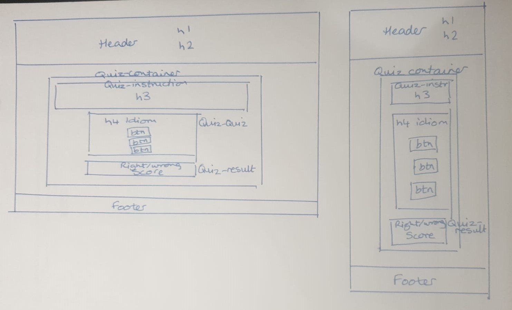
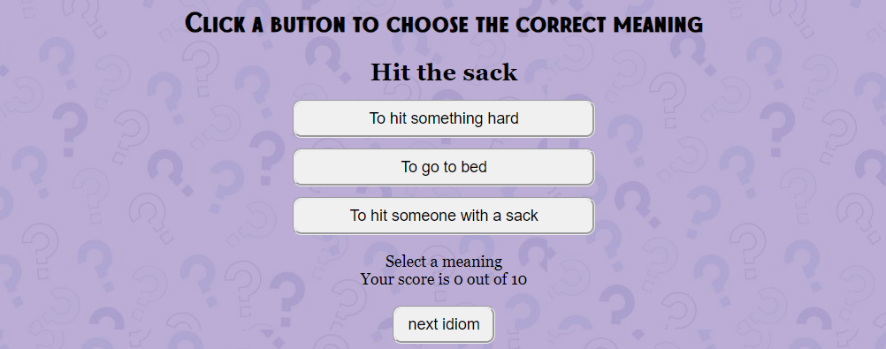
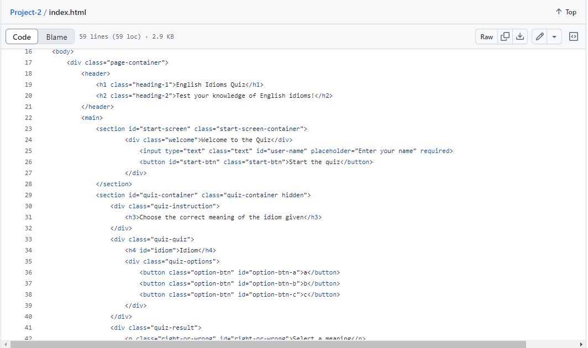
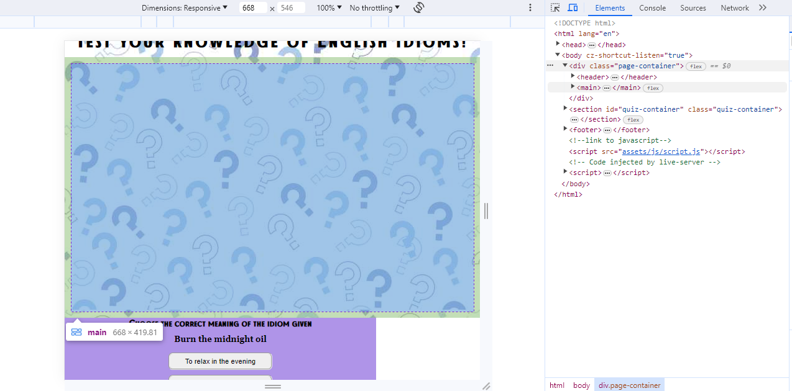

# ENGLISH IDIOMS QUIZ
Code Institude Second Portfolio Project HTML, CSS and Javascript

This is a quiz designed to test the user's understanding of the meanings of English idioms. It was inspired by my work as a teacher of English as a Foreign Language.

Visit the live site [here](https://tori-coder.github.io/Project-2/)

## CONTENTS
1. [Design](#design)
2. [Features](#features)
3. [UX](#ux)
4. [Testing](#testing)
5. [Credits](#credits) 

## DESIGN

### Wireframes
Wireframes were sketched by hand. 

The styling was deliberately kept simple in order to spend my limited time concentrating on the javascript.

### Background and Colour Choices
- The background quiz image was chosen from [shutterstock.com](https://www.shutterstock.com/) and the colour palette created using [coolors.co](https://coolors.co)

### Fonts
The main header is styled in Cupcake, from [befonts.com](https://cupcake-font.html). 

Secondary headers are in TheArtistSans, also from [befonts.com](https://cupcake-font.html).

The displayed idiom and answer section are in Times New Roman.

Button text is the default button font.

## FEATURES

### Contents

**Header**

The header contains the quiz name and explanation of what the quiz tests.

**Quiz interface**

- The quiz interface consists of an idiom and three buttons with alternative meanings. The user is instructed to click a button to choose the correct meaning of the idiom. 
- On selection of one of the buttons, the user is informed if their choice is correct or incorrect, and the score is amended accordingly. Pressing the "next idiom" button loads the next idiom. 
- There are ten idioms per quiz. At the end of the quiz, the user is informed and a "start new quiz" button is displayed, which runs the quiz again when clicked.

**Footer**

The footer contains credit and link to my [github page](https://github.com/Tori-coder)

### Potential Future Features

Owing to a leave of absence and a tight deadline on my return to the course, I was unable to include many features that I wanted to. I shall continue to work on these after submission.

- A start screen with feature for users to enter their name - see [Unfixed Bugs](###unfixed-bugs) below
- A high scores table
- A feature to download correct answers for future learning
- A better styled alert for correct/incorrect answers, including moving images and sound
- The javascript should be refactored to reduce repetition

## UX

### Visitor Objectives

* Instantly understand who and what the quiz is for;
* Be able to navigate the quiz easily;
* Understand the rules of the quiz before starting the game;
* Know the score during and after playing the quiz

## TESTING

### Fixed Bugs

- On first testing it was possible to click the option buttons more than once, allowing more than one guess per idiom. The event listeners were moved in the javascript so that after one guess the user has to click "next idiom".
- Further user testing revealed one of the answers in the array to be wrong. The array was corrected.

### Unfixed Bugs

- I attempted to add a start screen to input user name (to be used later with the end of quiz message). The code is contained in the [start-screen](https://github.com/Tori-coder/Project-2/tree/start-screen) branch. However, hiding the start screen changed the flow and caused the quiz itself to display below the main quiz area (the html was rendering with the quiz-container AFTER the <main> section). 
- Screenshot below. 
- My research and exhaustive troubleshooting failed to identify the cause of this bug. As a result the branch was not merged to main. The start screen feature is included in [Potential Future Features](#potential-future-features).

### Validation Testing

#### HTML and CSS

[W3C](https://validator.w3.org/) was used to validate the HTML. Passed.

[W3C jigsaw](https://jigsaw.w3.org/css-validator/) was used to validate the css. Passed.

#### Javascript testing

[jshint](https://jshint.com/) was used to validate the javascript. No errors found.

#### Chrome Developer Tools Lighthouse rating

### Browser Testing

| Browser   | Layout    | Functionality | 
| :--- | :---: | :---: |
| Chrome | ✔ | ✔ |
| Edge | ✔ | ✔ |
| Firefox | ✔ | ✔ |
| Safari | ✔ | ✔ |

### Manual Testing
Each time a feature was added, all the functions were tested to see if there was an impact.

The quiz was manually tested by a number of users on various devices. The quiz was played through various rounds. All features were found to function correctly.

## Deployment

The site was deployed on [github pages](https://tori-coder.github.io/Project-2/) from the main branch by the following steps:
* Git Hub repository choose Settings tab and Pages
* From drop down menu source section pick main branch
* Once the Save button is clicked the page provides the link to the completed website.(https://tori-coder.github.io//)

## CREDITS

- Quiz designed with reference to the Love Maths walkthrough project by Code Institute
- Favicon generated using [favicon.io](https://favicon.io/) using an image taken from [istock](https://www.istockphoto.com/)
- Model image of live website on different devices generated at [techsini.com](https://techsini.com/multi-mockup/index.php)
- Background image from [shutterstock.com](https://www.shutterstock.com/)
- Colour palette created using [coolors.co](https://coolors.co)
- Fonts from [befonts.com](https://cupcake-font.html)
- Images converted using [cloudconvert.com](https://cloudconvert.com/webp-converter)
- Images compressed using [imagecompressor.com](https://imagecompressor.com/)
- Styled popup alerts using [sweetalert](https://sweetalert2.github.io)
- This README file was constructed using [advice](https://github.com/kera-cudmore/readme-examples) from Kera Cudmore