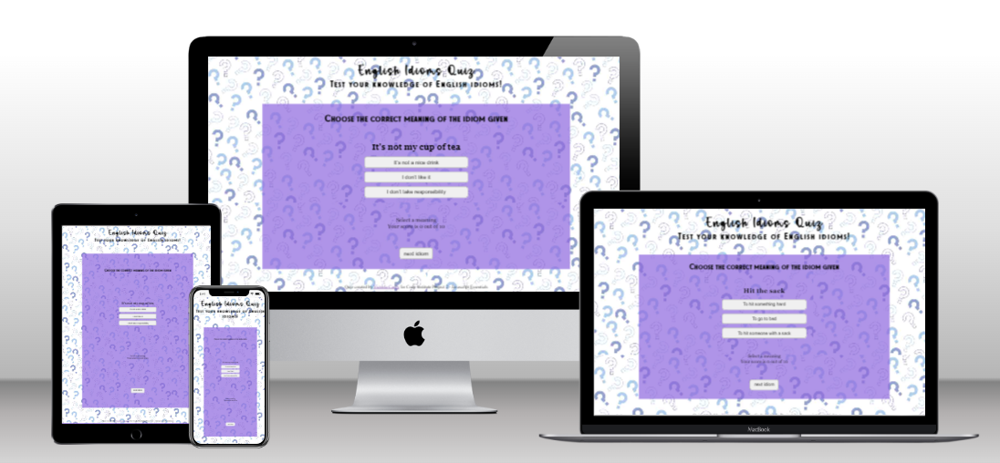

# ENGLISH IDIOMS QUIZ
Code Institude Second Portfolio Project HTML, CSS and Javascript

This is a quiz designed to test the user's understanding of the meanings of English idioms. It was inspired by my work as a teacher of English as a Foreign Language.

Visit the live site [here](https://tori-coder.github.io//)

## CONTENTS
1. [Design](#design)
2. [Features](#features)
3. [UX](#ux)
4. [Testing](#testing)
5. [Credits](#credits) 

## DESIGN

### Colour Choices
Colours were based on the background quiz image chosen and the palette created using [coolors.co](https://coolors.co)

### Fonts
The main header is styled in Cupcake, from [befonts.com](https://cupcake-font.html). 
Secondary headers are in TheArtistSans.
The displayed idiom and answer section are in Times New Roman.
Button text is the default button font.

### Images

## FEATURES

### Contents

**Quiz interface**

The quiz interface consists of an idiom and three buttons with alternative meanings. The user is instructed to choose the correct meaning of the idiom. On selection of one of the buttons, the user is informed if the meaning is correct or incorrect, and the score amended accordingly. Pressing the "next idiom" button loads the next idiom. 
There are ten idioms per quiz. At the end of the quiz, the user is informed and the "next idiom" button is replaced by a "start new quiz" button to start a new quiz.

## UX

### Visitor Objectives

* Instantly understand who and what the quiz is for;
* Be able to navigate the quiz easily;
* Understand the rules of the quiz before starting the game;
* Know how many questions there will be;
* Know the score during and after playing the quiz

## TESTING

### Fixed Bugs

### Unfixed Bugs

### Validation Testing

#### HTML and CSS

[W3C](https://validator.w3.org/) was used to validate the HTML.

[W3C jigsaw](https://jigsaw.w3.org/css-validator/) was used to validate the css.

#### Javascript testing

[jshint](https://jshint.com/) was used to validate the javascript.

#### Chrome Developer Tools Lighthouse rating

### Browser Testing

| Browser   | Layout    | Functionality | 
| :--- | :---: | :---: |
| Chrome |  |  |
| Edge |  |  |
| Firefox |  |  |
| Safari |  |  |

### Manual Testing

## Deployment

The site was deployed on [github pages] from the main branch by the following steps:
* Git Hub repository choose Settings tab and Pages
* From drop down menu source section pick main branch
* Once the Save button is clicked the page provides the link to the completed website.(https://tori-coder.github.io//)

## CREDITS

- Quiz designed with limited reference to the Love Maths walkthrough project by Code Institute
- Favicon generated using [favicon.io](https://favicon.io/) using an image taken from [istock](https://www.istockphoto.com/)
- Model image of live website on different devices generated at [techsini.com](https://techsini.com/multi-mockup/index.php)
- Images converted using [cloudconvert.com](https://cloudconvert.com/webp-converter)
- Images compressed using [imagecompressor.com](https://imagecompressor.com/)
- This README file was constructed using [advice](https://github.com/kera-cudmore/readme-examples) from Kera Cudmore 